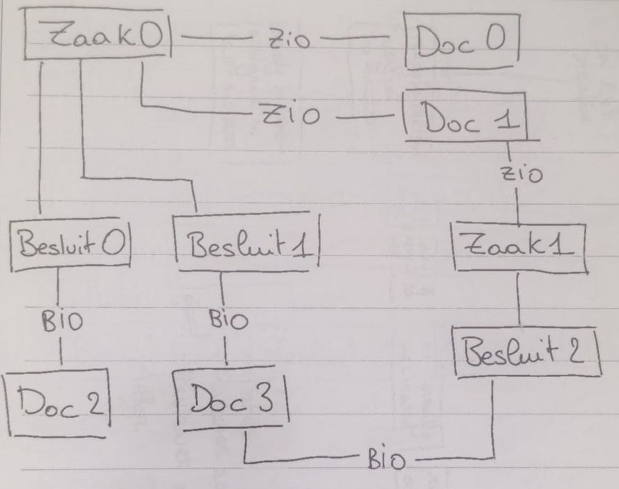

# Open Zaak

The `docker-compose.yml` compose file is available to run an instance of Open Zaak.

## docker compose

Start an instance in your local environment from this directory:

```bash
docker compose up
```

This brings up the admin at http://localhost:8003/admin/. You can log in with the `admin` / `admin`
credentials.

## Load fixtures

The fixtures in `./fixtures` are automatically loaded when the Open Zaak container starts.

The fixtures were generated by running Open Zaak locally and using the factories to create the 
various objects. The fixture ``complex_data.json`` contains the following objects and relations:



**Note 1** 

When dumping objects with loose-fk fields (like for example zaken), you get the following json: 

```json
{
        "model": "zaken.zaak",
        "pk": 5,
        "fields": {
            "_etag": "",
            "uuid": "f02254c3-ff7c-4d80-911e-7b9d5c640ed2",
            "_id": null,
            "_identificatie": "",
            "_bronorganisatie": "",
            "hoofdzaak": null,
            "omschrijving": "",
            "toelichting": "",
            "_zaaktype_base_url": null,
            "_zaaktype_relative_url": null,
            "_zaaktype_url": null,
            "_zaaktype": 1,
            "zaaktype": "engage collaborative solutions (2018-01-01)",
            "registratiedatum": "2024-07-08",
            "verantwoordelijke_organisatie": "708156423",
            "startdatum": "2024-07-07",
            "einddatum": null,
            "einddatum_gepland": null,
            "uiterlijke_einddatum_afdoening": null,
            "publicatiedatum": null,
            "producten_of_diensten": "[]",
            "communicatiekanaal": "",
            "vertrouwelijkheidaanduiding": "geheim",
            "betalingsindicatie": "",
            "laatste_betaaldatum": null,
            "zaakgeometrie": "SRID=4326;POINT (37.532256371904246 81.36577958653682)",
            "verlenging_reden": "",
            "verlenging_duur": null,
            "opschorting_indicatie": false,
            "opschorting_reden": "",
            "selectielijstklasse": "",
            "archiefnominatie": null,
            "archiefstatus": "nog_te_archiveren",
            "archiefactiedatum": null,
            "opdrachtgevende_organisatie": "",
            "processobjectaard": "",
            "startdatum_bewaartermijn": null,
            "processobject_datumkenmerk": "",
            "processobject_identificatie": "",
            "processobject_objecttype": "",
            "processobject_registratie": "",
            "communicatiekanaal_naam": "",
            "created_on": "2024-07-09T08:24:41.432Z"
        }
    }
```

When loading the fixture, this gives the error: 

```
Traceback (most recent call last):
  File "/usr/local/lib/python3.10/site-packages/django/core/serializers/json.py", 
    yield from PythonDeserializer(objects, **options)
  File "/usr/local/lib/python3.10/site-packages/django/core/serializers/python.alizer
    obj = base.build_instance(Model, data, using)
  File "/usr/local/lib/python3.10/site-packages/django/core/serializers/base.py", nce
    return Model(**data)
  File "/usr/local/lib/python3.10/site-packages/django/db/models/base.py", line 
    _setattr(self, field.attname, val)
  File "/usr/local/lib/python3.10/site-packages/django_loose_fk/fields.py", line 
    setattr(instance, field_name, value)
  File "/usr/local/lib/python3.10/site-packages/zgw_consumers/models/fields.py", 
    raise ValueError(
ValueError: The base part of url engage collaborative solutions (2018-01-01) is not found in 'Service' data
```

To fix this, this part of the json needs to be updated:

```
"_zaaktype_base_url": null,
"_zaaktype_relative_url": null,
"_zaaktype_url": null,
"_zaaktype": 1,
"zaaktype": "engage collaborative solutions (2018-01-01)",
```

to:

```
"_zaaktype": 1,
```

**Note 2**

When trying to delete a document that has been loaded through a fixture, an error happens because the corresponding file is not created on disk (see: https://github.com/open-zaak/open-zaak/issues/1711).

To get around this problem, I manually created an empty file in the container.