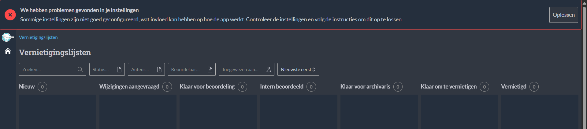

.. _devops_deploying:

=========
Deploying
=========

We currently have 2 ways to deploy:

#. With Ansible: 
   For deploying with Ansible, we use the ``maykinmedia/commonground-deployment`` repo.
#. With Kubernetes:
   For deploying with Kubernetes, we use the charts in the ``maykinmedia/charts`` repo and the values in the ``maykinmedia/kubernetes-deployment`` repo.

Please see the respective (private) repositories mentioned above for more information on deployment.

Ngnix
=====

In Open Archiefbeheer, the frontend does not add CSP headers to the responses, which means that this has to be done with Nginx.
However, one has to be careful that Nginx does not override the headers added by the backend to the api endpoints and to the 
admin pages.

We have an example of a simple configuration that does this in our docker-compose.yaml file:

.. literalinclude:: ../../../docker-nginx-default.conf
  

Here we define a variable ``$csp_headers`` which contains either the default CSP headers that nginx should add to the response (needed for the frontend)
or the CSP headers that are already present in the response (in the case that the backend has already added the headers).
In this way we don't override the backend CSP headers.

Open Zaak
=========

The minimum supported version of Open Zaak is ``1.18.0``.

.. _devops-deploying-configuration:

Configuration
=============

After a successful deploy, the app will show a banner saying that there are errors that need to be fixed. This is **not**
something that went wrong during deployment, but it means that the application still needs to be configured.

This configuration is meant to be done by Administrators with specific domain-knowledge of the processes. For this reason,
this part of the configuration was not automated via ``django-setup-configuration``.

FEATURE_FLAGS
=============

- ``FEATURE_RELATED_COUNT_DISABLED``: Setting this environment variable to `True` will disable the inline presentation
  of the related objects selection. This may significantly reduce load on external registers and improve performance.
