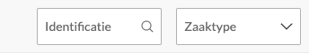

.. _manual_1-record-manager_1.1-vernietigingslijst-opstellen:

============================
Vernietigingslijst opstellen
============================

Deze handleiding beschrijft de stappen die een **record manager** kan volgen om een nieuwe vernietigingslijst aan te
maken binnen de applicatie.

Voorwaarden
------------
- De record manager moet beschikken over een actieve gebruikersaccount met de juiste toegangsrechten.
- Er moeten zaken aanwezig zijn in de applicatie.
- Een beoordelaar moet bestaan om toegewezen te worden aan de vernietigingslijst.

Stappen
-------

1. **Inloggen als record manager**
    - Open de applicatie en log in met je gebruikersnaam en wachtwoord of via je organisatie login.
    - Na succesvol inloggen, wordt je automatisch doorgestuurd naar het overzicht van bestaande vernietigingslijsten.

2. **Navigeren naar de pagina voor het aanmaken van een nieuwe lijst**
    - Klik op de knop **“Vernietigingslijst opstellen”**. |vernietigingslijst_opstellen_link|
    - Je wordt doorgestuurd naar de pagina **“Vernietigingslijst opstellen”**.

3. **Filters gebruiken**
    - Gebruik de gewenste filters, bijvoorbeeld op **identificatie** of **zaaktype** om specifieke items te vinden. |filters|

4. **Selecteer zaken voor de vernietigingslijst**
    - Op de pagina zie je een lijst van beschikbare zaken.
    - Klik op het selectievak naast een zaak om deze te selecteren. |checkbox_zaak|
    - Je kunt ook de selectievakken bovenaan gebruiken om alle zichtbare zaken, of alle pagina's in één keer te selecteren
      of deselecteren. |checkbox_zaken|

5. **Bevestig de selectie**
    - Klik op de knop **“Vernietigingslijst opstellen”** om door te gaan met de geselecteerde zaken. |vernietigingslijst_opstellen_actie|

6. **Vul de vereiste informatie in**
    - Op het formulier dat verschijnt, vul je de volgende velden in:
        - **Naam**: Geef een duidelijke en unieke naam voor de vernietigingslijst, bijvoorbeeld:
            **“Mijn eerste vernietigingslijst”**.
        - **Beoordelaar**: Kies een beoordelaar uit de lijst die je wilt toewijzen aan de vernietigingslijst.

   Formulier voor het opstellen van een nieuwe vernietigingslijst met velden voor **"Naam"**, **"Beoordelaar"** en
   **"Opmerking"**.

7. **Bevestig de aanmaak van de lijst**
    - Klik op de knop **“Vernietigingslijst opstellen”** om de lijst definitief aan te maken.

8. **Controleer de aangemaakte lijst**
    - Na bevestiging word je teruggeleid naar de pagina **"Vernietigingslijsten"**.
    - De vernietigingslijst verschijnt in het overzicht met de status *"Nieuw"*.

Let op
------
- Controleer altijd of alle velden correct zijn ingevuld voordat je de lijst aanmaakt.
- Indien je een fout hebt gemaakt, kun je de lijst later bewerken of verwijderen.

Met deze stappen kun je een vernietigingslijst opstellen en een beoordelaar toewijzen. De lijst kan nog worden
:ref:`aangepast<manual_1-record-manager_1.2-vernietigingslijst-bewerken>` voordat deze definitief wordt gemaakt en ter
controle wordt :ref:`aangeboden aan de beoordelaar<manual_1-record-manager_1.3-vernietigingslijst-klaarzetten-voor-beoordeling>`.

