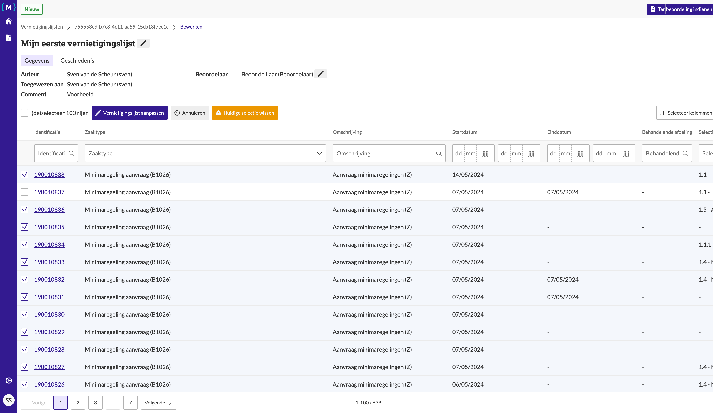
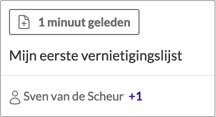
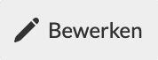

.. _manual_1-record-manager_1.2-vernietigingslijst-bewerken:

===========================
Vernietigingslijst bewerken
===========================

Deze handleiding beschrijft de stappen die een **record manager** kan volgen om een bestaande vernietigingslijst te 
bewerken binnen de applicatie, inclusief het aanpassen van de naam van de lijst.

Voorwaarden
------------
- De record manager moet beschikken over een actieve gebruikersaccount met de juiste toegangsrechten.
- Er moet een bestaande vernietigingslijst aanwezig zijn.

Stappen
-------

1. **Inloggen als record manager**
    - Open de applicatie en log in met je gebruikersnaam en wachtwoord of via je organisatie login.
    - Na succesvol inloggen, word je automatisch doorgestuurd naar het overzicht van bestaande vernietigingslijsten.

2. **Open de vernietigingslijst**
    - Zoek in het overzicht naar de lijst die je wilt bewerken.
    - Klik op de naam van de lijst, bijvoorbeeld **"Mijn eerste vernietigingslijst"**.

      |vernietigingslijst_kaart|

    - Je wordt doorgestuurd naar de pagina met details van de lijst.

3. **Start het bewerken**
    - Klik op de knop **"Bewerken"** om de lijst aan te passen. |vernietigingslijst_bewerken|
    - Je wordt doorgestuurd naar de bewerkingspagina van de vernietigingslijst.

4. **Zaken toevoegen**
    - Navigeer naar de juiste pagina van de lijst indien deze meerdere pagina's bevat.
    - Selecteer extra zaken door op de checkbox naast de gewenste zaken te klikken.
    - Klik op de knop **"Vernietigingslijst aanpassen"** om de wijzigingen op te slaan.

5. **Zaken verwijderen**
    - Navigeer naar de juiste pagina van de lijst.
    - Deselecteer zaken door op de checkbox naast de ongewenste zaken te klikken.
    - Klik op de knop **"Vernietigingslijst aanpassen"** om de wijzigingen op te slaan.

6. **Filters gebruiken**
    - Klik op het filtericoon en selecteer de gewenste filters, bijvoorbeeld op **identificatie** of **zaaktype**.
    - Pas filters toe om specifieke zaken te vinden en te beheren binnen de vernietigingslijst.
    - Voeg zaken toe of verwijder zaken zoals eerder beschreven.

7. **Naam van de lijst aanpassen**
    - Klik op de knop **"Naam bewerken"** om de naam van de lijst te wijzigen. |naam_bewerken|
    - Vul de nieuwe lijstnaam in, bijvoorbeeld **"Vernietigingslijst"** in het veld **"Naam"**.
    - Klik op de knop **"Opslaan"** om de naamwijziging door te voeren.

8. **Controleer de wijzigingen**
    - Na het opslaan van de aanpassingen word je teruggeleid naar de lijstweergave.
    - De zaken die je hebt toegevoegd of verwijderd, evenals de nieuwe naam van de lijst, worden voortaan weergegeven in de lijst.

Let op
------
- Controleer altijd of alle wijzigingen correct zijn doorgevoerd voordat je de lijst definitief maakt.
- Gebruik filters om snel specifieke zaken te vinden en aan te passen.
- Indien nodig kun je wijzigingen later opnieuw bewerken.
- De lijstnaam kan op elk moment aangepast worden, maar zorg ervoor dat je de nieuwe naam opslaat.

Met deze stappen kun je een vernietigingslijst bewerken, zaken toevoegen of verwijderen, de naam van de lijst aanpassen,
en filters gebruiken om je selectie te verfijnen. De volgende stap is om de lijst definitief te maken en
:ref:`aan te bieden aan de beoordelaar<manual_1-record-manager_1.3-vernietigingslijst-klaarzetten-voor-beoordeling>`.

