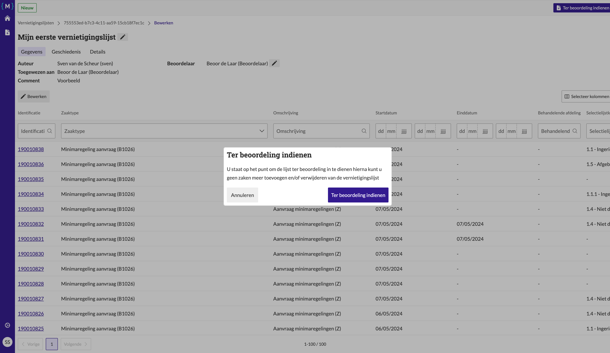

.. _manual_1-record-manager_1.3-vernietigingslijst-klaarzetten-voor-beoordeling:

===============================================
Vernietigingslijst klaarzetten voor beoordeling
===============================================

Deze handleiding beschrijft de stappen die een **record manager** kan volgen om een vernietigingslijst klaar te zetten 
voor beoordeling binnen de applicatie.

Voorwaarden
------------
- De record manager moet beschikken over een actieve gebruikersaccount met de juiste toegangsrechten.
- Er moet een bestaande vernietigingslijst aanwezig zijn.
- Er moeten **beoordelaars** aan de lijst zijn toegewezen.

Stappen
-------

1. **Inloggen als record manager**
    - Open de applicatie en log in met je gebruikersnaam en wachtwoord of via je organisatie login.
    - Na succesvol inloggen, wordt je automatisch doorgestuurd naar het overzicht van bestaande vernietigingslijsten.

2. **Open de vernietigingslijst**
    - Zoek de vernietigingslijst die je klaar wilt zetten voor beoordeling. Bijvoorbeeld
      **"Mijn eerste vernietigingslijst"**.
    - Klik op de naam van de lijst om de details van de lijst te openen.

3. **Zet de lijst klaar voor beoordeling**
    - Klik op de knop **"Ter beoordeling indienen"** om de lijst als klaar voor beoordeling in te dienen. |ter_beoordeling_indienen|
    - Bevestig de actie door opnieuw op de knop **"Ter beoordeling indienen"** te klikken in het vervolgscherm.

4. **Controleer de status**
    - Nadat de lijst klaar is gezet voor beoordeling, word je teruggeleid naar het overzicht van de
      vernietigingslijsten.
    - De status van de lijst wordt bijgewerkt naar **"Klaar voor beoordeling"**.

Let op
------
- Zorg ervoor dat alle noodzakelijke zaken correct zijn toegevoegd en geselecteerd voordat je de lijst voor beoordeling
  indient.
- Controleer altijd of de juiste beoordelaar aan de lijst is toegewezen voordat je de lijst klaarmaakt voor beoordeling.
- De lijst kan niet meer bewerkt worden nadat deze is ingediend voor beoordeling, om een ingediende lijst toch te
  bewerken moet eerst het beoordelingsproces worden
  :ref:`afgebroken<manual_1-record-manager_1.4-beoordelingsproces-afbreken>`.

Zodra de lijst is klaargezet voor beoordeling, kan de beoordelaar de lijst inzien en
:ref:`beoordelen<manual_2-beoordelaar-archivaris_2.1-vernietigingslijst-beoordelen>` op basis van de geselecteerde zaken en
informatie. De beoordelaar kan de lijst goedkeuren of afwijzen. Indien de lijst wordt goedgekeurd zal de status worden
bijgewerkt naar **"Intern beoordeeld"** en kan de lijst worden aangeboden aan de archivaris. Indien de lijst wordt
afgekeurd, zal de status worden bijgewerkt naar **"Wijzigingen aangevraagd"** waarna de eventueel afgekeurde zaken
kunnen worden :ref:`aangepast<manual_1-record-manager_1.5-beoordeling-verwerken>` en de lijst opnieuw kan worden
ingediend voor beoordeling.

