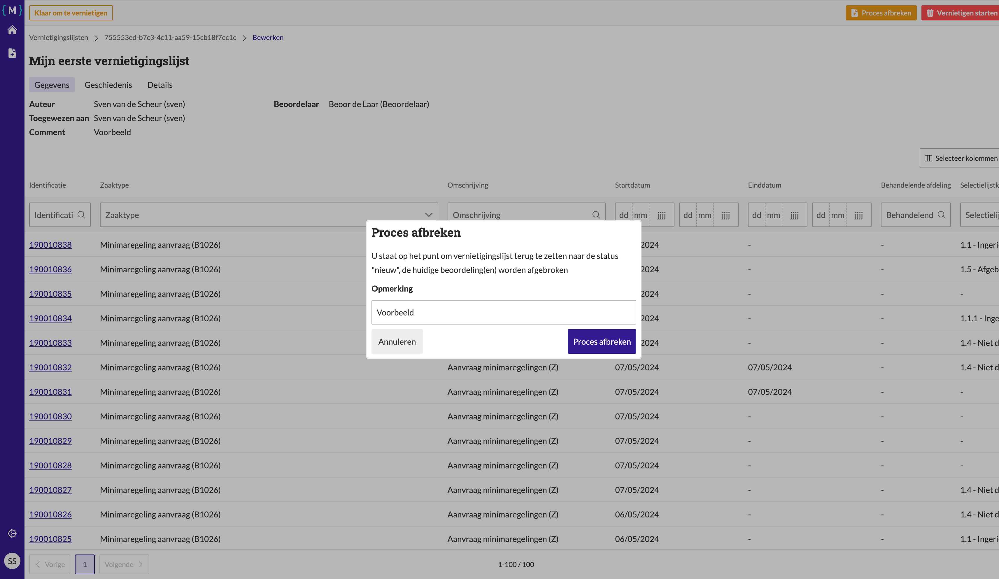

.. _manual_1-record-manager_1.4-beoordelingsproces-afbreken:

=============================
(Beoordelings)proces afbreken
=============================

Deze handleiding beschrijft de stappen die een **record manager** kan volgen om een beoordelingsproces proces af te
breken binnen de applicatie, dit is noodzakelijk wanneer een ingediende lijst moet worden aangepast of verwijderd.

Voorwaarden
------------
- De record manager moet beschikken over een actieve gebruikersaccount met de juiste toegangsrechten.
- Er moet een bestaande vernietigingslijst aanwezig zijn zonder de status **"Nieuw"** of **"Vernietigd"**.

Stappen
-------

1. **Inloggen als record manager**
    - Open de applicatie en log in met je gebruikersnaam en wachtwoord of via je organisatie login.
    - Na succesvol inloggen, word je automatisch doorgestuurd naar het overzicht van bestaande vernietigingslijsten.

2. **Open de vernietigingslijst**
    - Zoek de vernietigingslijst die je wilt afbreken, bijvoorbeeld **"Mijn eerste vernietigingslijst"**.
    - Klik op de naam van de lijst om de details van de lijst te openen.

3. **Proces afbreken**
    - Klik op de knop **"Proces afbreken"** om het proces te stoppen. |proces_afbreken|
    - Vul de reden voor het afbreken van het proces in.
    - Bevestig de actie door op de knop **"Proces afbreken"** te klikken in het vervolgscherm.

4. **Controleer de status**
    - Nadat je het proces hebt afgebroken, wordt je doorgestuurd naar de bewerkingspagina van de vernietigingslijst.
    - De status van de lijst wordt bijgewerkt naar **"Nieuw"** en alle voortgang van het proces wordt teruggezet.

Let op
------
- Zorg ervoor dat je een opmerking toevoegt bij het afbreken van het proces, zodat de reden duidelijk is.
- Het afbreken van het proces zet de status van de lijst terug naar **"Nieuw"**, wat betekent dat het proces opnieuw kan 
  worden gestart.

Na het afbreken van het proces kan de lijst opnieuw worden
:ref:`bewerkt<manual_1-record-manager_1.2-vernietigingslijst-bewerken>` en verder worden verwerkt. Het proces kan later
opnieuw worden gestart of aangepast om verder te gaan met de beoordeling.

