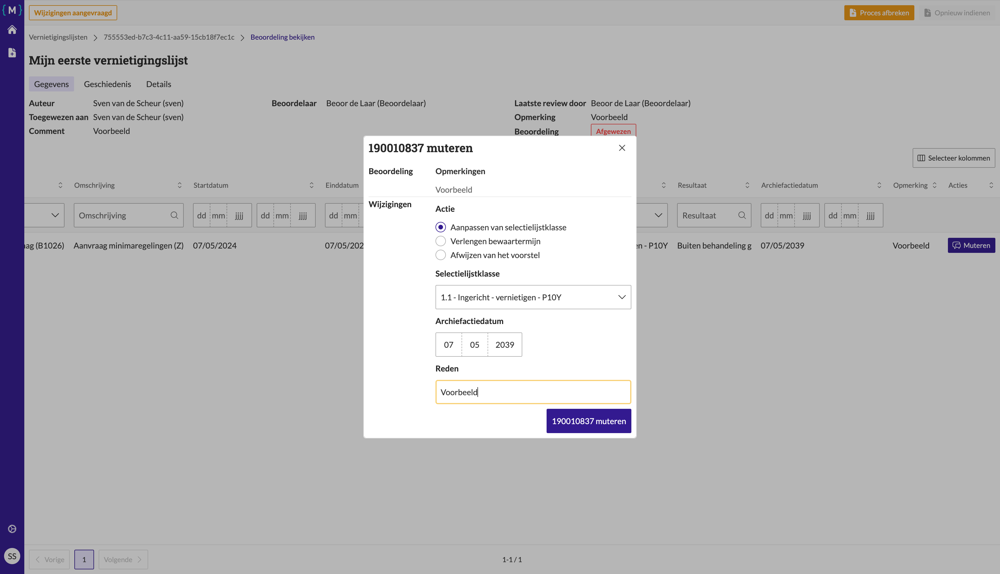

.. _manual_1-record-manager_1.5-beoordeling-verwerken:

=====================
Beoordeling verwerken
=====================

Deze handleiding beschrijft de stappen die een **record manager** kan volgen om een vernietigingslijst te verwerken na
een beoordeling door een **beoordelaar**. Het proces kan onder meer het aanpassen van de selectielijstklasse of het
verlengen van de bewaartermijn omvatten.

Deze handleiding gaat ervan uit dat de record manager al een beoordeling heeft ontvangen en de lijst moet aanpassen 
voordat deze opnieuw kan worden ingediend voor beoordeling.

Voorwaarden
------------
- De record manager moet beschikken over een actieve gebruikersaccount met de juiste toegangsrechten.
- Er moet een bestaande vernietigingslijst zijn met de status **"Wijzigingen aangevraagd"**.
- Een beoordelaar moet al een beoordeling hebben uitgevoerd en de lijst moet de beslissing **"Afgewezen"** bevatten.
- De lijst moet zaken bevatten die aangepast moeten worden.

Stappen
-------

1. **Inloggen als record manager**
    - Open de applicatie en log in met je gebruikersnaam en wachtwoord of via je organisatie login.
    - Na succesvol inloggen, word je automatisch doorgestuurd naar het overzicht van bestaande vernietigingslijsten.

2. **Open de vernietigingslijst**
    - Zoek de vernietigingslijst die je wilt verwerken. Bijvoorbeeld **"Mijn eerste vernietigingslijst"**.
    - Klik op de naam van de lijst om de details van de lijst te openen.

3. **Beoordeel de wijzigingen**
    - Je wordt doorgestuurd naar de pagina waar je de beoordeling kunt verwerken.
    - Klik op de knop **"Muteren"** om wijzigingen aan te brengen. |muteren_knop|

4. **Selectielijstklasse aanpassen**
    - Indien nodig, selecteer je de optie **"Aanpassen van selectielijstklasse"**.
    - Vul het veld **"Selectielijstklasse"** in, bijvoorbeeld **"11.1 - Verleend - vernietigen - P1Y"**.

5. **Bewaartermijn verlengen**
    - Kies de optie **"Verlengen bewaartermijn"**.
    - Vul de gewenste **"Dag van de maand"** in (bijvoorbeeld **09/15/2023**).
    - Je kunt de bewaartermijn niet verlengen voor zaken waarvoor de selectielijst een archiefnominatie van
      **"blijvend bewaren"** heeft.

6. **Afwijzen van het voorstel**
    - Kies de optie **"Afwijzen van het voorstel"** om zaak niet te muteren (en opnieuw aan te bieden aan de
      beoordelaar).

.. figure:: ../_assets/muteren-formulier.png
    :align: center
    :alt: muteren formulier
    :height: 523px

    Zaak mutatie formulier met keuzes **"Aanpassen van selectielijstklasse"**, **"Verlengen bewaartermijn"** en
    **"Afwijzen van het voorstel"**.

7. **Opmerking toevoegen en opnieuw indienen**
    - Vul de reden voor de wijziging in.
    - Klik op de knop **"Muteren"** om de wijziging door te voeren.
    - Klik daarna op **"Opnieuw indienen"** om de gewijzigde lijst in te dienen. |opnieuw_indienen_knop|
    - Voeg een opmerking toe, bijvoorbeeld **"Datum aangepast"**, en klik op **"Opnieuw indienen"** in het vervolgscherm.

      |opnieuw_indienen_formulier|

8. **Controleer de status**
    - Nadat je de wijzigingen hebt ingediend, wordt je teruggeleid naar het overzicht van de vernietigingslijsten.
    - De status van de lijst wordt bijgewerkt naar **"Klaar voor beoordeling"**.

Let op
------
- Zorg ervoor dat je de selectielijstklasse correct aanpast als dat nodig is.
- Zaken waarvan de selectielijst of bewaartermijn wordt aangepast worden verwijdert van de vernietigingslijst.
- Vergeet niet een reden voor de wijziging in te vullen en de lijst opnieuw in te dienen.
- Nadat de lijst opnieuw is ingediend, zal deze opnieuw beoordeeld moeten worden door een beoordelaar.

Na het indienen kan de lijst door de beoordelaar opnieuw worden
:ref:`bekeken<manual_2-beoordelaar-archivaris_2.1-vernietigingslijst-beoordelen>`. De beoordelaar kan de lijst goedkeuren
of verdere wijzigingen aanvragen.

