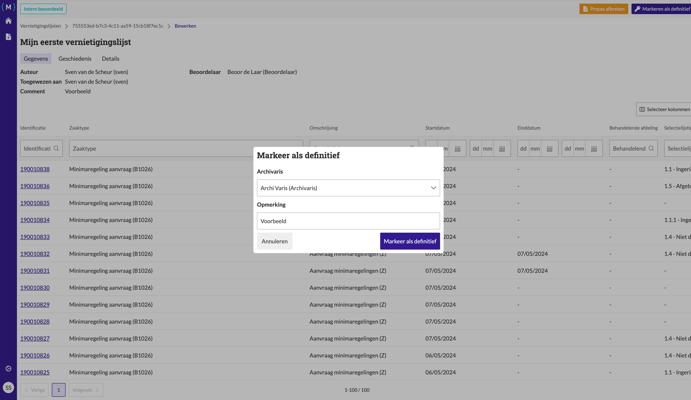
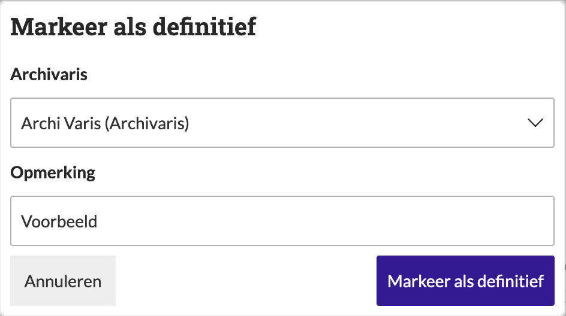

.. _manual_1-record-manager_1.6-vernietigingslijst-klaarzetten-voor-archivaris:

========================================================================
Vernietigingslijst klaarzetten voor archivaris (als definitief markeren)
========================================================================

Deze handleiding beschrijft de stappen die een **record manager** kan volgen om een vernietigingslijst als definitief te
markeren nadat de lijst is beoordeeld door een **beoordelaar**. Het proces bevat het toevoegen van een archivaris en een
opmerking voordat de lijst als definitief wordt gemarkeerd.

Voorwaarden
------------
- De record manager moet beschikken over een actieve gebruikersaccount met de juiste toegangsrechten.
- Er moet een bestaande vernietigingslijst zijn met de status **"Intern beoordeeld"**.
- Een beoordelaar moet een beoordeling hebben uitgevoerd en de lijst moet de beslissing **"Goedgekeurd"** bevatten.

Stappen
-------

1. **Inloggen als record manager**
    - Open de applicatie en log in met je gebruikersnaam en wachtwoord of via je organisatie login.
    - Na succesvol inloggen, word je automatisch doorgestuurd naar het overzicht van bestaande vernietigingslijsten.

2. **Open de vernietigingslijst**
    - Zoek de vernietigingslijst die je wilt markeren als definitief. Bijvoorbeeld **"Mijn eerste vernietigingslijst"**.
    - Klik op de naam van de lijst om de details van de lijst te openen.

3. **Markeer de lijst als definitief**
    - Klik op de knop **"Markeren als definitief"** om de lijst als definitief te markeren. |markeren_als_definitief_knop|
    - Vul het veld **"Archivaris"** in door de naam van de archivaris te selecteren.
    - Vul het veld **"Opmerking"** in.

   Formulier voor het markeren van de lijst als definitief met velden voor **"Archivaris"** en **"Opmerking"**.

4. **Definitief markeren**
    - Klik op de knop **"Markeer als definitief"** om de lijst definitief te markeren.
    - De lijst zal nu de status **"Klaar voor archivaris"** krijgen en is gereed voor verdere verwerking door de archivaris.

5. **Controleer de status**
    - Nadat je de lijst als definitief hebt gemarkeerd, wordt je teruggeleid naar het overzicht van de vernietigingslijsten.
    - De status van de lijst wordt bijgewerkt naar **"Klaar voor archivaris"**.

Let op
------
- Zorg ervoor dat je het juiste **"Archivaris"** selecteert voordat je de lijst markeert als definitief.
- Nadat de lijst is gemarkeerd als definitief, zal de archivaris de lijst verder verwerken.

Na het markeren van de lijst als definitief, wordt de lijst doorgestuurd naar de archivaris voor verdere verwerking. De
archivaris voert een laatste :ref:`beoordeling<manual_2-reviewer-archivaris_2.1-vernietigingslijst-beoordelen>` uit en
kan de lijst goedkeuren of afwijzen. Indien de lijst wordt goedgekeurd zal de status worden bijgewerkt naar
**"Klaar om te vernietigen"** en kan de vernietiging van de geselecteerde zaken worden
:ref:`gestart<manual_1-record-manager_1.7-vernietigingslijst-vernietigen>`. Indien de lijst wordt afgekeurd, zal de status
worden bijgewerkt naar **"Wijzigingen aangevraagd"**.

