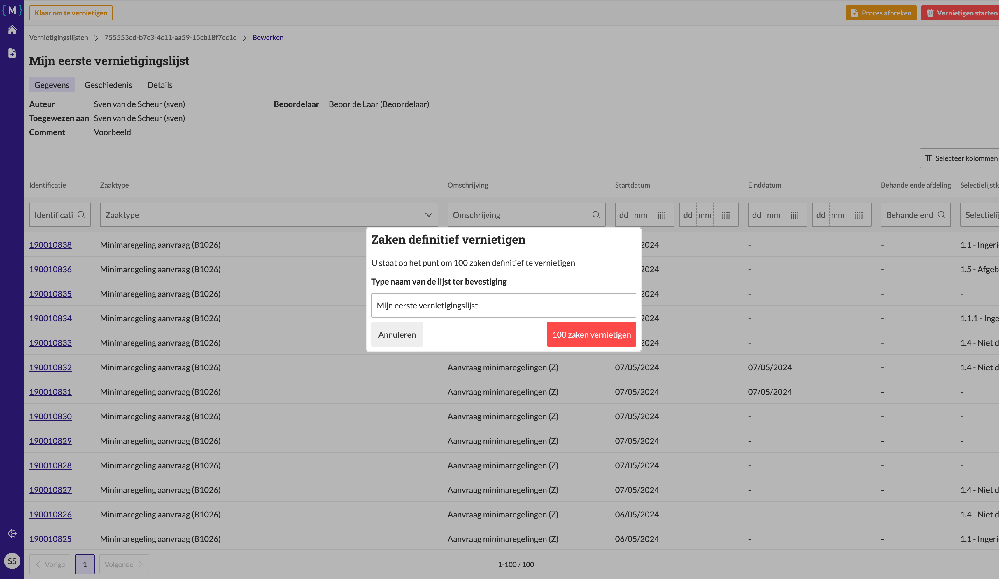
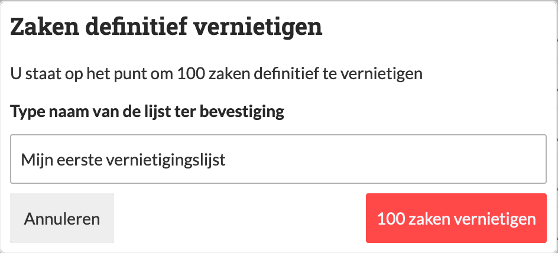

.. _manual_1-record-manager_1.7-vernietigingslijst-vernietigen:

==============================
Vernietigingslijst vernietigen
==============================

Deze handleiding beschrijft de stappen die een **record manager** kan volgen om een vernietigingslijst te vernietigen 
wanneer de lijst de status **"Klaar voor vernietigen"** heeft. Het proces omvat de bevestiging van de lijst en het 
starten van de vernietiging van de geselecteerde zaken.

Voorwaarden
------------
- De record manager moet beschikken over een actieve gebruikersaccount met de juiste toegangsrechten.
- Er moet een bestaande vernietigingslijst zijn met de status **"Klaar voor vernietigen"**.
- De archiveringsdatum van de zaken in de lijst moet zijn verstreken.

Stappen
-------

1. **Inloggen als record manager**
    - Open de applicatie en log in met je gebruikersnaam en wachtwoord of via je organisatie login.
    - Na succesvol inloggen, word je automatisch doorgestuurd naar het overzicht van bestaande vernietigingslijsten.

2. **Open de vernietigingslijst**
    - Zoek de vernietigingslijst die je wilt vernietigen, bijvoorbeeld **"Mijn eerste vernietigingslijst"**.
    - Klik op de naam van de lijst om de details van de lijst te openen.

3. **Start de vernietiging**
    - Klik op de knop **"Vernietigen starten"** om het vernietigingsproces te starten. |vernietigen_starten_knop|
    - Vul het veld **"Type naam van de lijst ter bevestiging"** in met de naam van de lijst om te bevestigen dat je de
      lijst wilt vernietigen.

      |vernietigen_starten_formulier|

4. **Bevestig de vernietiging**
    - Klik op de knop **"Zaken vernietigen"** om de geselecteerde zaken te vernietigen.
    - Er wordt een **bedenktijd van 7 dagen** ingesteld voordat de vernietiging wordt uitgevoerd.
    - Binnen de bedenktijd kun je de vernietiging annuleren. Klik hiervoor op **"Vernietigen annuleren"** om de status
      van de lijst terug te zetten naar **"Nieuw"** (zie ook
      :ref:`(Beoordelings)proces afbreken<manual_1-record-manager_1.4-beoordelingsproces-afbreken>`).
    - Na afloop van de bedenktijd worden de geselecteerde zaken definitief verwijderd uit het gekoppelde zaaksysteem.
      Er wordt vervolgens een verklaring van vernietiging gegenereerd en de lijst wordt gemarkeerd als **"Vernietigd"**.

5. **Controleer de status**
    - Nadat je de vernietiging hebt gestart, wordt je teruggeleid naar het overzicht van de vernietigingslijsten.
    - De status van de lijst wordt bijgewerkt naar **"Vernietigd"** zodra de zaken succesvol zijn vernietigd en een
      verklaring van vernietiging is gegenereerd.

Let op
------
- Zorg ervoor dat je de juiste lijst selecteert en de naam correct typt ter bevestiging voordat je de vernietiging start.
- Het proces van vernietigen kan niet ongedaan worden gemaakt, dus wees er zeker van dat je de juiste lijst kiest.
- De lijst zal worden gemarkeerd als **"Vernietigd"** zodra de zaken zijn verwijderd.

Na het vernietigen van de lijst worden de geselecteerde zaken permanent verwijderd. Het proces kan afhankelijk van het 
systeem verder geautomatiseerd zijn. Na het vernietigen van de lijst kan de record manager een verklaring van
vernietiging downloaden met gegevens van de vernietigde zaken en details van het review proces.

