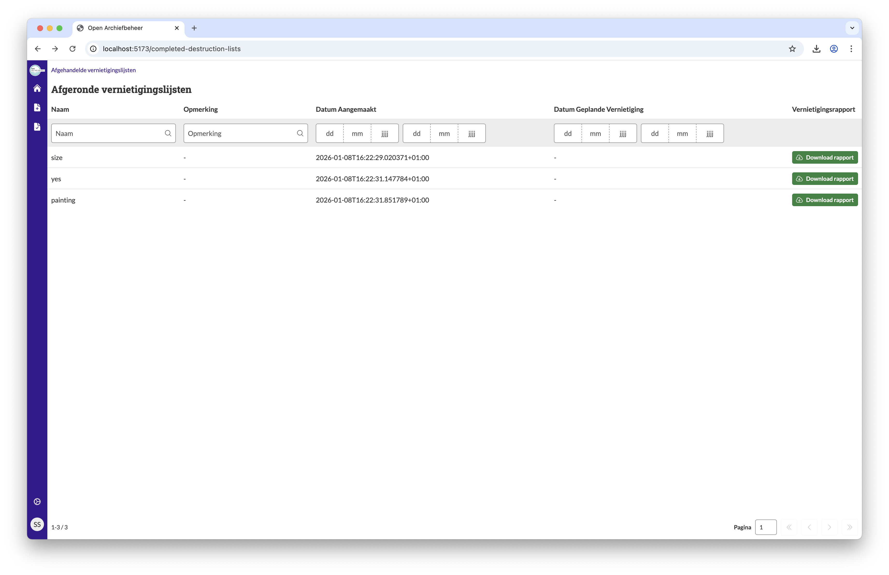

.. _manual_1-record-manager_1.9-afgeronde-vernietigingslijsten:

==============================
Afgeronde vernietigingslijsten
==============================

Deze handleiding beschrijft hoe afgeronde vernietigingslijsten kunnen worden bekeken en hoe de verklaring van
vernietiging kan worden gedownload. Afgeronde vernietigingslijsten zijn lijsten waarvan de vernietiging succesvol is
uitgevoerd.

Voorwaarden
------------
- Er moet minimaal één vernietigingslijst zijn met de status **"Vernietigd"**.

Stappen
-------

1. **Inloggen**
    - Open de applicatie en log in met je gebruikersnaam en wachtwoord of via je organisatie login.
    - Na succesvol inloggen, word je doorgestuurd naar het overzicht van vernietigingslijsten.

2. **Open Afgeronde vernietigingslijsten**
    - Klik op de knop **"Afgeronde vernietigingslijsten"**. |afgeronde_vernietigingslijsten_knop|
    - Je wordt doorgestuurd naar een overzicht van alle afgeronde vernietigingslijsten.

3. **Download de verklaring van vernietiging**
    - In het overzicht kun je per vernietigingslijst de verklaring van vernietiging downloaden.
    - Klik op **"Download rapport"** bij de gewenste lijst. |rapport_downloaden|

Let op
------
- Afgeronde vernietigingslijsten kunnen niet meer worden gewijzigd.
- Na afronding zijn vernietigingslijsten alleen nog beschikbaar via dit overzicht.

