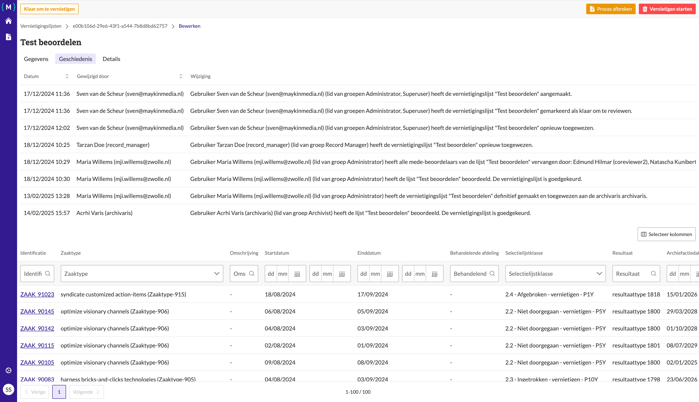

.. _manual_1-record-manager_2.0-audit-log-bekijken:

==================
Audit log bekijken
==================

Deze handleiding beschrijft de stappen die een gebruiker kan volgen om een audit log te bekijken.

Voorwaarden
------------
- De gebruiker moet beschikken over een actieve gebruikersaccount met de juiste toegangsrechten.
- Er moet een bestaande vernietigingslijst aanwezig zijn.

Stappen
-------

1. **Inloggen als gebruiker**
    - Open de applicatie en log in met je gebruikersnaam en wachtwoord of via je organisatie login.
    - Na succesvol inloggen word je automatisch doorgestuurd naar het overzicht van vernietigingslijsten.

2. **Open de vernietigingslijst**
    - Zoek in het overzicht naar de lijst waarvoor je de audit log wilt bekijken.
    - Klik op de naam van de lijst, bijvoorbeeld **"Mijn eerste vernietigingslijst"**.

3. **Open de audit log**
    - Klik op het tabblad **"Geschiedenis"** om de audit log te bekijken.

Let op
------

In de audit log zie je een overzicht van wijzigingen, inclusief datum, tijd en de gebruiker die de wijziging heeft
doorgevoerd.