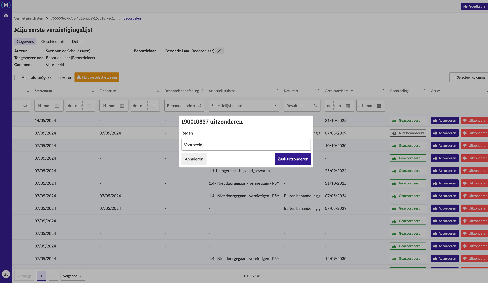
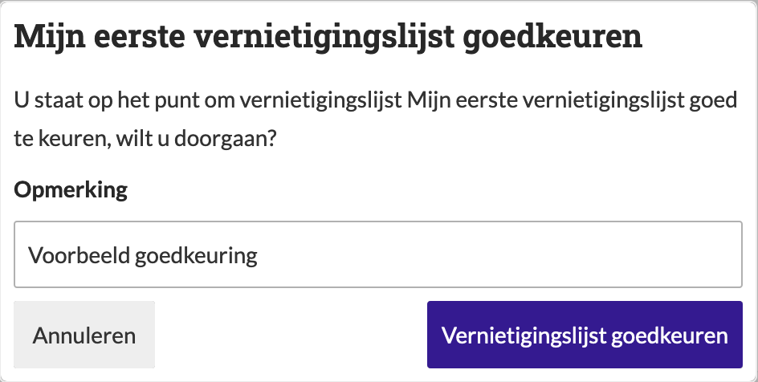
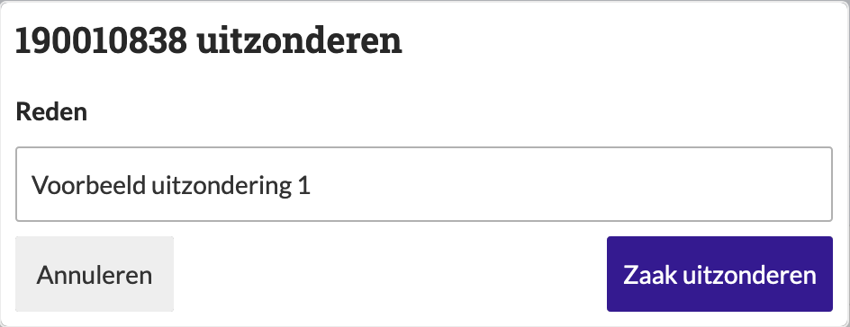
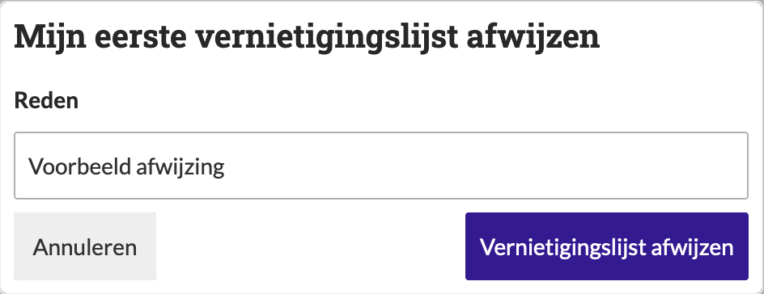

.. _manual_2-reviewer-archivaris_2.1-vernietigingslijst-beoordelen:

=============================
Vernietigingslijst beoordelen
=============================

Deze handleiding beschrijft de stappen die een **beoordelaar** of **archivaris** kan volgen om een vernietigingslijst te 
beoordelen binnen de applicatie.

Voorwaarden
------------
- De beoordelaar of archivaris moet beschikken over een actieve gebruikersaccount met de juiste toegangsrechten.
- De vernietigingslijst moet de status **"Klaar voor beoordeling"** (beoordelaar) of **"Klaar voor archivaris"**
  (archivaris) hebben.

Stappen
-------

1. **Inloggen als beoordelaar of archivaris**
    - Open de applicatie en log in met je gebruikersnaam en wachtwoord of via je organisatie login.
    - Na succesvol inloggen, word je automatisch doorgestuurd naar het overzicht van bestaande vernietigingslijsten.

2. **Open de vernietigingslijst**
    - Zoek de vernietigingslijst die je wilt beoordelen. Bijvoorbeeld **"Mijn eerste vernietigingslijst"**.
    - Klik op de naam van de lijst om de details van de lijst te openen.

3. **Beoordeel de vernietigingslijst**
    - Bekijk de zaken in de lijst en controleer of alles voldoet aan de beoordelingscriteria, markeer zaken optioneel
      als accoord door op **"Accorderen"** te klikken. |accorderen|
    - Als alles correct is, klik op de knop **"Goedkeuren"** om de lijst goed te keuren. |goedkeuren_knop|
    - Vul een opmerking in indien nodig en bevestig de goedkeuring door op **"Vernietigingslijst goedkeuren"** te klikken.

        |goedkeuren_formulier|

4. **Afwijzen van de lijst**
    - Als er zaken zijn die niet voldoen, klik dan op de knop **"Uitzonderen"** voor de desbetreffende zaak(en). |uitzonderen_knop|
    - Vul een reden in voor de afwijzing en klik op **"Zaak uitzonderen"**.

      |uitzonderen_formulier|

    - Klik op **"Afwijzen"** om de lijst af te wijzen. |afwijzen_knop|
    - Vul een opmerking in indien nodig en bevestig de afwijzing door op **"Vernietigingslijst afwijzen"** te klikken.

        |afwijzen_formulier|

    - De status van de lijst wordt bijgewerkt naar **"Wijzigingen aangevraagd"**.

5. **Controleer de status**
    - Nadat je de lijst hebt goedgekeurd of afgewezen, wordt de status van de lijst bijgewerkt.
        - **"Intern beoordeeld"** bij goedkeuring door de beoordelaar.
        - **"Klaar om te vernietigen"** bij goedkeuring door de archivaris.
        - **"Wijzigingen aangevraagd"** bij afwijzing door de beoordelaar/archivaris.

Let op
------
- Ongeselecteerde zaken (niet geaccordeerd/uitgezonderd) worden automatisch goedgekeurd bij het goedkeuren van de lijst.
- Na goedkeuring door de beoordelaar moet de lijst door de archivaris worden beoordeeld.
- Als er gebruik gemaakt wordt van mede-beoordelen kunnen er accorderingen/uitzonderingen van de mede-beoordelaar(s)
  zichtbaar worden.
- Alleen de hoofdbeoordelaar kan de lijst goedkeuren of afwijzen.

Na goedkeuring kan de lijst worden doorgestuurd naar de archivaris voor de laatste goedkeuring. Als de lijst wordt 
afgekeurd, moet de record manager de aangevraagde wijzigingen
:ref:`verwerken<manual_1-record-manager_1.5-beoordeling-verwerken>` voordat de lijst opnieuw kan worden
:ref:`ingediend<manual_1-record-manager_1.3-vernietigingslijst-klaarzetten-voor-beoordeling>`.

