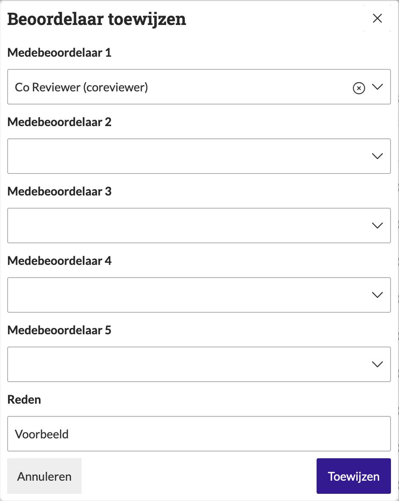
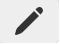

.. _manual_2-reviewer-archivaris_2.2-medebeoordelaars-toewijzen:

==========================
Medebeoordelaars toewijzen
==========================

Deze handleiding beschrijft de stappen voor het toewijzen van **medebeoordelaars** en hoe zij kunnen samenwerken aan de 
beoordeling van een vernietigingslijst binnen de applicatie.

Voorwaarden
------------
- De hoofdbeoordelaar moet beschikken over een actieve gebruikersaccount met de juiste toegangsrechten.  
- De vernietigingslijst moet al klaarstaan voor beoordeling.
- Medebeoordelaars moeten bestaan om toegewezen te worden aan de vernietigingslijst.  

Stappen
-------

1. **Inloggen als hoofdbeoordelaar**
    - Open de applicatie en log in met je gebruikersnaam en wachtwoord of via je organisatie login.
    - Je wordt automatisch doorgestuurd naar het overzicht van bestaande vernietigingslijsten.

2. **Open de vernietigingslijst**
    - Zoek de vernietigingslijst waarvoor je medebeoordelaars wilt toewijzen. Bijvoorbeeld **“Mijn eerste vernietigingslijst”**.
    - Klik op de naam van de lijst om de details te openen.

3. **Medebeoordelaars toewijzen**
    - Klik op de knop **"Beoordelaar bewerken"**. |beoordelaars_bewerken_knop|
    - Selecteer de gewenste medebeoordelaars.
    - Vul de reden voor de toewijzing in.
    - Klik op **"Toewijzen"** om de medebeoordelaars definitief toe te wijzen.

4. **Controleer de status**
    - Nadat je de medebeoordelaars hebt toegewezen, worden de medebeoordelaars weergegeven in de lijst met beoordelaars.

Na het toewijzen kunnen de medebeoordelaars de lijst bekijken en
:ref:`beoordelen<manual_2-reviewer-archivaris_2.1-vernietigingslijst-beoordelen>`. Beoordelingen van alle
(mede)beoordelaars zijn zichtbaar voor alle andere beoordelaars. Alleen de hoofdbeoordelaar kan de lijst goedkeuren of
afwijzen.

