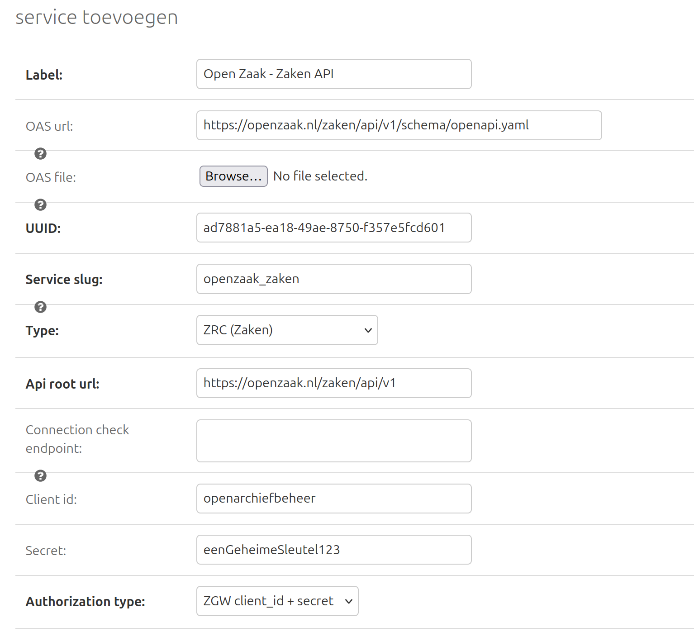
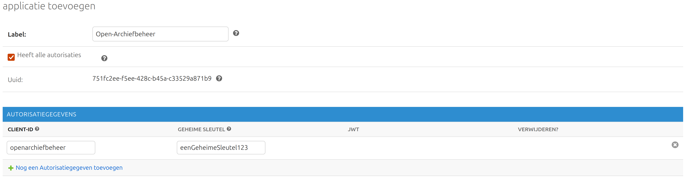

.. _manual_3-administrator_3.2-external-apis:

==========================
Externe API's Configureren
==========================

Deze handleiding beschrijft hoe een **functioneel beheerder** externe API-diensten kan configureren in de applicatie.

Checklist
=========

1. Diensten die geconfigureerd moeten worden:

   * Zaken API
   * Catalogi API
   * Documenten API
   * Besluiten API
   * Selectielijst API

2. In de **API-configuratie** specificeer je welke service gebruikt moet worden voor de Selectielijst API.

Diensten
========

De diensten kunnen worden geconfigureerd onder **Externe API's** > **Services** en door op **Service toevoegen** te clicken. |service_toevoegen|
|service_config|

De velden **client id** en **secret** moeten overeen komen met de waarden geconfigureerd in Open Zaak, onder **API Autorisaties** > **Applicaties**.
|oz_applicatie_config|

API-configuratie
=================

Onder **Externe API's** > **API-configuratie** kun je selecteren welke service gebruikt moet worden om de Selectielijst API te raadplegen.

