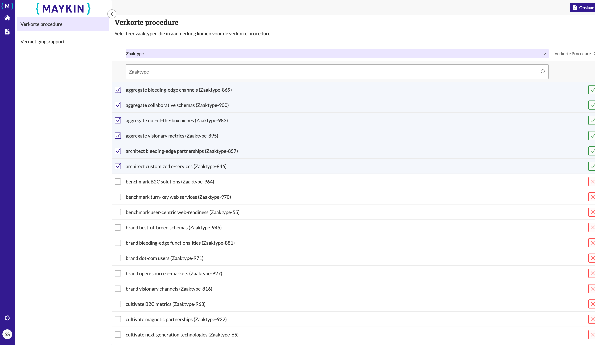
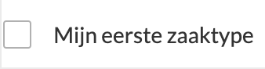

.. _manual_3-administrator_3.3-verkorte-procedure-configureren:

===============================
Verkorte procedure configureren
===============================

Deze handleiding beschrijft de stappen die een **Administrator** kan volgen om de zaaktypen te selecteren die in
aanmerking komen voor de verkorte procedure.

Voorwaarden
------------
- De administrator moet beschikken over een actieve gebruikersaccount met de juiste toegangsrechten.
- De zaaktype keuzes moeten beschikbaar zijn voor selectie.

Stappen
-------

1. **Inloggen als administrator**
    - Open de applicatie en log in met je gebruikersnaam en wachtwoord.
    - Na succesvol inloggen, word je automatisch doorgestuurd naar de pagina van de vernietigingslijsten.

2. **Navigeer naar de instellingen voor de verkorte procedure**
    - Klik op de knop **"Instellingen"** in het menu. |instellingen_knop|
    - Klik vervolgens op de knop **"Verkorte procedure"**. |verkorte_procedure_knop|

3. **Selecteer zaaktypen voor de verkorte procedure**
    - Klik op het selectievak naast een zaaktype om deze te selecteren. |checkbox_zaaktype|

4. **Sla de instellingen op**
    - Klik op de knop **"Opslaan"**. |opslaan_knop|
    - Controleer of de melding **"De instellingen zijn succesvol opgeslagen"** verschijnt.

5. **Controleer de configuratie**
    - De zaaktype die in aanmerking komen voor de verkorte procedure zijn aangeduid met een groen vinkje. |boolean_true|

Let op
------
- Zorg ervoor dat de zaaktypen correct zijn geselecteerd voordat je de instellingen opslaat.
- Controleer altijd of de juiste zaaktypen aan de verkorte procedure zijn toegevoegd.
- Klik op de **Home** knop om terug te gaan de de **"Vernietigingslijsten"** pagina. |home|

.. |instellingen_knop| image:: ../_assets/instellingen-knop.png
   :alt: Instellingen knop
   :height: 32px

.. |opslaan_knop| image:: ../_assets/opslaan-knop.png
   :alt: Opslaan knop
   :height: 26px

.. |home| image:: ../_assets/home.png
    :alt: Home knop
    :height: 32px