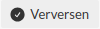

.. _manual_3.4-administrator_3.4-vernietigingsrapport-configureren:

=================================
Vernietigingsrapport configureren
=================================

.. figure:: ../_assets/pages/vernietigingsrapport-configureren.png
   :align: center
   :alt: Vernietigingsrapport configureren schermafbeelding

Deze handleiding beschrijft de stappen die een **administrator** kan volgen om een vernietigingsrapport te configureren.

Voorwaarden
------------
- De administrator moet beschikken over een actieve gebruikersaccount met de juiste toegangsrechten.
- Externe services moeten zijn :ref:`geconfigureerd<manual_3-administrator_3.2-external-apis>`.
- Open Zaak moet beschikken over correct ingerichte en gepubliceerde objecttypen die voldoen aan de hieronder beschreven voorwaarden.

Configuratievoorwaarden
-----------------------

Voor het configureren van een verklaring van vernietiging moeten de geselecteerde instellingen aan specifieke voorwaarden voldoen.
De voorwaarden zijn per objecttype beschreven. Geneste opsommingen geven afhankelijkheden aan.

Rapport
^^^^^^^
Om het verklaring van vernietiging te kunnen aanmaken, heeft Open Archiefbeheer de volgende configuratieonderdelen nodig:

- **Bronorganisatie**
- **Zaaktype**
- **Informatieobjecttype**
- **Statustype** (optioneel)
- **Resultaattype**

Bronorganisatie
^^^^^^^^^^^^^^^
- Dit moet het **RSIN van de organisatie** zijn.

Zaaktype
^^^^^^^^
Voorbeeld naam: *“Bevestiging van vernietiging”*.

Het geselecteerde zaaktype moet voldoen aan de volgende voorwaarden:

- Het zaaktype is **gepubliceerd**.
- Het zaaktype heeft minimaal:

  - **1 gerelateerd InformatieObjectType**
    - Vastgelegd via *ZaakTypeInformatieObjectType*.
  - **1 gerelateerd RolType**
  - **2 gerelateerde StatusType instanties**
    - Een beginstatus
    - Een eindstatus
  - **1 gerelateerd ResultaatType**

InformatieObjectType
^^^^^^^^^^^^^^^^^^^^
Voorbeeld naam: *“Verklaring van vernietiging”*.

Het geselecteerde informatieobjecttype moet:

- **Gepubliceerd** zijn.

Dit informatieobjecttype wordt gebruikt voor het opslaan van de verklaring van vernietiging als
een *enkelvoudiginformatieobject*.

StatusType
^^^^^^^^^^
*(optioneel)*

Voorbeeld naam: *“Afgerond”*.

Indien geconfigureerd, moet dit statustype:

- Gekoppeld zijn aan het geselecteerde zaaktype.

ResultaatType
^^^^^^^^^^^^^
Voorbeeld naam: *“Verwerkt”*.

Het geselecteerde resultaattype moet:

- Gekoppeld zijn aan het geselecteerde zaaktype.

De bijbehorende selectielijstklasse wordt afgeleid van dit resultaattype.

Gedrag bij aanmaken verklaring van vernietiging
------------------------------------------------
Wanneer een verklaring van vernietiging wordt aangemaakt:

- Wordt automatisch een **zaak** aangemaakt met het geconfigureerde zaaktype.
- De **archiefnominatie van de aangemaakte zaak wordt altijd ingesteld op
  _“blijvend bewaren”_**.
- De zaak krijgt:

  - Het geconfigureerde resultaattype.
  - Optioneel het geconfigureerde statustype.

- De verklaring van vernietiging wordt opgeslagen als een **enkelvoudiginformatieobject**
  met het geconfigureerde informatieobjecttype.
- De zaak en het enkelvoudiginformatieobject worden onderling aan elkaar gerelateerd.

Stappen
-------

1. **Inloggen als administrator**
    - Open de applicatie en log in met je gebruikersnaam en wachtwoord of via je organisatie login.
    - Na succesvol inloggen word je automatisch doorgestuurd naar het overzicht van vernietigingslijsten.

2. **Navigeer naar de instellingen voor het vernietigingsrapport**
    - Klik op de knop **"Instellingen"** in het menu. |instellingen_knop|
    - Klik op **"Vernietigingsrapport"** om naar de configuratiepagina te gaan. |vernietigingsrapport_knop|

3. **Vul de vereiste velden in**
    - Vul de benodigde gegevens in de bijbehorende velden:

      - **Bronorganisatie**
      - **Zaaktype**
      - **Informatieobjecttype**
      - **Statustype** (optioneel)
      - **Resultaattype**

.. note::

    Nieuwe zaaktypen, informatieobjecttypen, statustypen of resultaattypen die tijdens het configureren beschikbaar komen in
    Open Zaak, worden niet automatisch weergegeven in de dropdownmenu's. Klik op de knop **"Verversen"** om de nieuwste
    opties zichtbaar te maken. |verversen_knop|

4. **Sla de instellingen op**
    - Klik op de knop **"Opslaan"**. |opslaan_knop|
    - Controleer of de melding **"De instellingen zijn succesvol opgeslagen"** verschijnt.

5. **Controleer de configuratie**
    - Nadat de configuratie van het vernietigingsrapport is opgeslagen staan de ingevulde gegevens
      in de bijbehorende invoervelden.

Let op
------
- Controleer zorgvuldig dat alle ingevoerde gegevens correct zijn voordat je ze opslaat.
- Als een foutmelding verschijnt, controleer dan de ingevoerde waarden en probeer opnieuw.
- Wijzigingen kunnen later opnieuw worden aangepast via de instellingen.
- Klik op de **Home** knop om terug te gaan naar de **"Vernietigingslijsten"** pagina. |home|

.. |instellingen_knop| image:: ../_assets/instellingen-knop.png
   :alt: Instellingen knop
   :height: 32px

.. |vernietigingsrapport_knop| image:: ../_assets/vernietigingsrapport-knop.png
   :alt: Vernietigingsrapport knop
   :height: 42px

.. |opslaan_knop| image:: ../_assets/opslaan-knop.png
   :alt: Opslaan knop
   :height: 26px

