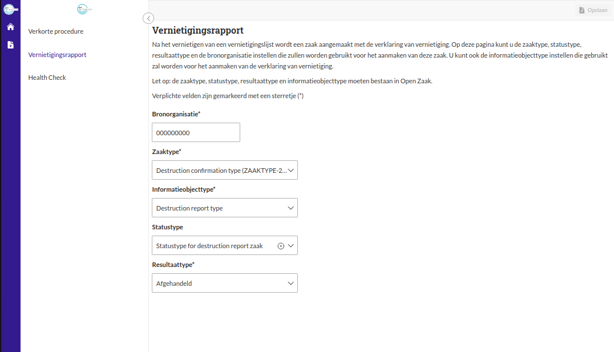

.. _manual_3.4-administrator_3.4-vernietigingsrapport-configureren:

=================================
Vernietigingsrapport configureren
=================================

Deze handleiding beschrijft de stappen die een **administrator** kan volgen om een vernietigingsrapport te configureren.

Voorwaarden
------------
- De administrator moet beschikken over een actieve gebruikersaccount met de juiste toegangsrechten.
- Externe services moeten zijn :ref:`geconfigureerd<manual_3-administrator_3.2-external-apis>`.
- Een zaaktype, informatieobjecttype, resultaattype en een statustype (optioneel) moeten geconfigureerd zijn in Open Zaak.
  De zaaktype moet gerelateerd zijn an één resultaattype en één informatieobjecttype.

Stappen
-------

1. **Inloggen als administrator**
    - Open de applicatie en log in met je gebruikersnaam en wachtwoord of via je organisatie login.
    - Na succesvol inloggen word je automatisch doorgestuurd naar het overzicht van vernietigingslijsten.

2. **Navigeer naar de instellingen voor het vernietigingsrapport**
    - Klik op de knop **"Instellingen"** in het menu. |instellingen_knop|
    - Klik op **"Vernietigingsrapport"** om naar de configuratiepagina te gaan. |vernietigingsrapport_knop|

3. **Vul de vereiste velden in**
    - Vul de benodigde gegevens in de bijbehorende velden:
    
      - **Bronorganisatie**. Dit moet een RSIN zijn.
      - **Zaaktype**
      - **Statustype** (optioneel)
      - **Resultaattype**
      - **Informatieobjecttype**

    Als de verklaring van vernietiging aagemaakt wordt, zal een zaak aangemaakt worden met de geconfigureerde zaaktype. De zaak zal een resultaat hebben 
    met de geconfigureerd resultaattype en de selectielijstklasse wordt afgeleid van de resultaattype. De verklaring van vernietiging wordt opgeslagen als
    enkelvoudiginformatieobject met de geconfigureerde informatieobjecttype. De zaak en de enkelvoudiginformatieobject worden met elkaar gerelateerd.

.. note::

    Nieuwe zaaktypen, informatieobjecttypen, statustypen of resultaattypen die tijdens het configureren beschikbaar komen in 
    Open Zaak, worden niet automatisch weergegeven in de dropdownmenu's. Klik op de knop "Verversen" om de nieuwste 
    opties zichtbaar te maken. |verversen_knop|

.. |verversen_knop| image:: ../_assets/verversen-knop.png
   :alt: Knop om zaaktypen, informatieobjecttypen, statustypen en resultaattypen te verversen
   :height: 26px

4. **Sla de instellingen op**
    - Klik op de knop **"Opslaan"**. |opslaan_knop|
    - Controleer of de melding **"De instellingen zijn succesvol opgeslagen"** verschijnt.

5. **Controleer de configuratie**
    - Nadat de configuratie van het vernietigingsrapport is opgeslagen staan de ingevulde gegevens in de bijbehorende
      invoervelden.

Let op
------
- Controleer zorgvuldig dat alle ingevoerde gegevens correct zijn voordat je ze opslaat.
- Als een foutmelding verschijnt, controleer dan de ingevoerde waarden en probeer opnieuw.
- Wijzigingen kunnen later opnieuw worden aangepast via de instellingen.
- Klik op de **Home** knop om terug te gaan de de **"Vernietigingslijsten"** pagina. |home|

.. |vernietigingsrapport_knop| image:: ../_assets/vernietigingsrapport-knop.png
   :alt: Vernietigingsrapport knop
   :height: 42px

.. |home| image:: ../_assets/home.png
    :alt: Home knop
    :height: 32px
